<picture>
  <source media="(prefers-color-scheme: dark)" srcset="assets/header-dark.svg">
  
</picture>

 

I build AI products end to end: the agents and models, the APIs behind them, the web app on top, and the native iOS client when it needs one.

Previously on the iOS Payments team at **JPMorgan Chase**, where I moved Storyboard/UIKit flows to SwiftUI with MVVM, and at **KPMG**. Final-year CS (Data Science) at Manipal University Jaipur. **10+ hackathon wins**, including Smart India Hackathon 2025, Google Codeclash 2.0 (1st) and ZS Campus Beats 2026 (2nd runner-up, AI Builders).

### Selected work

<a href="https://github.com/Swastikkkkk/amexpert"><picture><source media="(prefers-color-scheme: dark)" srcset="assets/card-amexpert-dark.svg"></picture></a>
<a href="https://github.com/Swastikkkkk/PrepNinja"><picture><source media="(prefers-color-scheme: dark)" srcset="assets/card-prepninja-dark.svg"></picture></a>
<a href="https://github.com/Swastikkkkk/District_Mesh"><picture><source media="(prefers-color-scheme: dark)" srcset="assets/card-district-mesh-dark.svg"></picture></a>
<a href="https://github.com/Swastikkkkk/chatsnitch"><picture><source media="(prefers-color-scheme: dark)" srcset="assets/card-chatsnitch-dark.svg"></picture></a>
<a href="https://github.com/Swastikkkkk/guardian-backend"><picture><source media="(prefers-color-scheme: dark)" srcset="assets/card-guardian-dark.svg"></picture></a>
<a href="https://github.com/Swastikkkkk/agentdrift"><picture><source media="(prefers-color-scheme: dark)" srcset="assets/card-agentdrift-dark.svg"></picture></a>

More: [DisasterAR](https://github.com/Swastikkkkk/disasterevac) (offline AR evacuation, ARKit) · [CCTV emergency detection](https://github.com/Swastikkkkk/WomenSafety) (YOLO, CLIP) · [EchoBin](https://github.com/Swastikkkkk/Echobin) (React Native, NFC) · [ReachOut](https://github.com/Swastikkkkk/Reachout_Hackathon) (Flutter, Gemini)

### Stack

  

**AI:** LLM agents, tool calling, RAG, Gemini and Claude APIs, speech (Deepgram, ElevenLabs), computer vision (YOLO, CLIP)

### Activity

<picture>
  <source media="(prefers-color-scheme: dark)" srcset="https://raw.githubusercontent.com/Swastikkkkk/Swastikkkkk/output/snake-dark.svg">
  
</picture>

 

[swastikdutt@gmail.com](mailto:swastikdutt@gmail.com)
